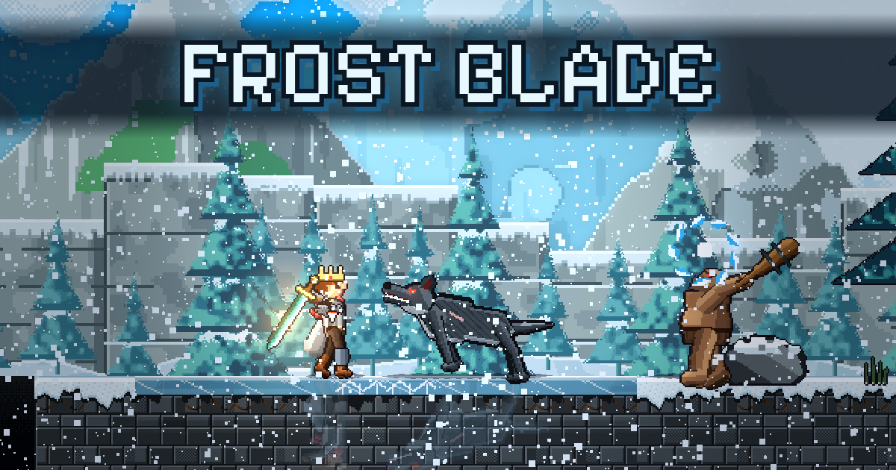

# Frost Blade

A pixel-art 2D action game built on three.js. The hero travels north through successive stages (winter forest, ice cave, castle ruins, icy peaks, frozen lake), fights wolves, ogres, yetis, ice golems and wraiths, collects loot from smashed chests and dodges traps.

Along the way the character grows by leveling up and learning talents with active skills, completes quests for merchants, hunts for gear of rising rarity (axes, spears, daggers, staves, bows, harpoons, armor, rings, legendary uniques), and progress is saved locally in the browser. A bestiary records every foe met, its health and what hurts it most.

The world is built from tiles with platforms, walls and chasms. The bow aims at any angle, a pickaxe climbs ice walls and shatters ice blocks, and heavy blows break the frozen lake into holes to fall through. Bosses fight in phases and show their health at the top of the screen. Every character is drawn as posed pixel art with full animation sets, lit by 2D lights with bloom and color grading. The game has settings for graphics quality, difficulty, sound, key binding, gamepads and accessibility, and it can be installed and played offline.



## Setup

Requires Node.js.

Install dependencies:

```bash
npm install
```

Dev server with hot reload at <http://localhost:5173>:

```bash
npm run dev
```

Production build to the `dist` directory, `npm run preview` lets you check it locally:

```bash
npm run build
npm run preview
```

Headless tests of the game logic, run in Node without a browser:

```bash
npm run test
```

All the art is drawn pixel by pixel when the game starts, so loading is canvas work. This reports the wait until the game is playable, the cost of entering each stage and the cost of every sheet the game bakes:

```bash
npm run perf
```
